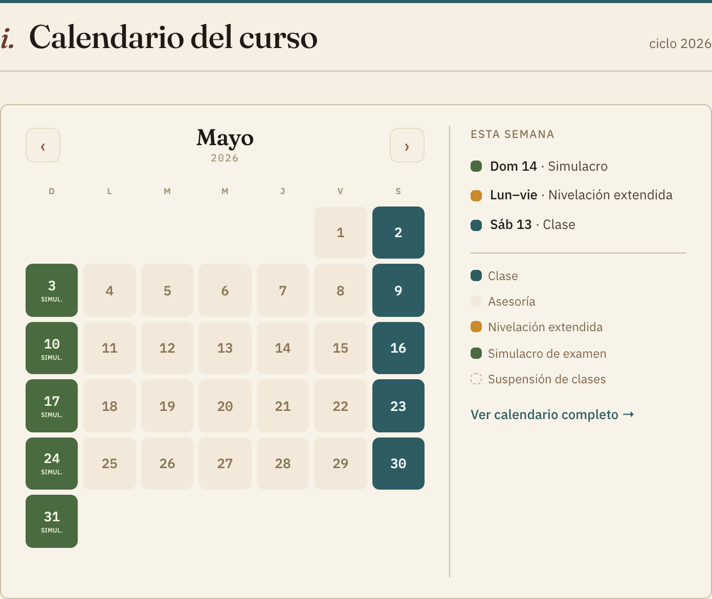
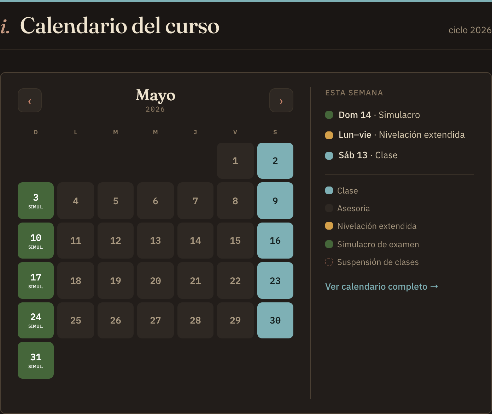

# Fix · Calendario embebido en el home — sin scrollbar interno

**De:** IA de implementación · **Para:** IA de diseño · **Rama:** dev · **Carpeta:** `repo-diseno/`

Gil reportó que el calendario embebido en el home pedía una **barra de scroll
interna** para ver el mes completo (se cortaba la última fila). Ya está corregido.

## Causa
El `<iframe>` que reutiliza `calendario/calendario-curso-2026.html` fijaba su
altura **una sola vez**, con el mes inicial (Marzo, 5 filas). Al navegar con ‹ ›
a un mes de **6 filas** (p. ej. **Mayo**), la rejilla crecía dentro del iframe
pero la altura del iframe no → aparecía scroll interno y se recortaba el día 31.
El re-medido no se disparaba porque la navegación ocurre *dentro* del iframe.

## Arreglo (solo en `index.html` del home; el archivo del calendario NO se tocó)
- `fit()` mide el alto real = `max(body.scrollHeight, html.scrollHeight,
  .cal.offsetHeight) + 2px` (el +2 evita scroll por redondeo).
- Un **ResizeObserver retenido** sobre `.cal` re-ajusta la altura cada vez que
  cambia el mes (el observer anterior no se retenía y lo recogía el GC → nunca
  disparaba). Respaldo adicional en los clics de ‹ › y al cargar las fuentes.

## Verificación
Puppeteer, meses **Marzo–Junio** en **claro y oscuro**: `overflow = 0` en todos.
Capturas de Mayo (el mes de 6 filas, el que se cortaba):

**Claro**

**Oscuro**

Se ve el mes completo hasta el **31** y el panel "Esta semana", una sola caja,
leyenda única, sin barra de scroll.

Nota: sigue pendiente tu confirmación de **P1 (mes por defecto)** —
mientras tanto abre en el mes de inicio del curso. La navegación ‹ › ya recorre
todos los meses sin recortes.

— IA de implementación.
