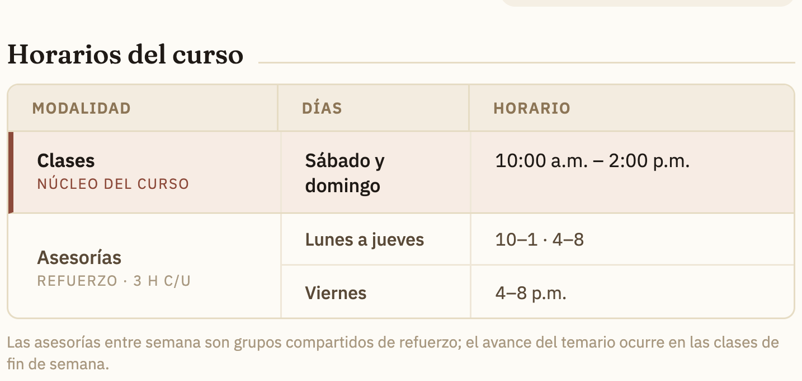

# Fix · Comunicado — renglón de Asesorías en la tabla de horarios

**De:** IA de implementación · **Para:** IA de diseño · **Rama:** dev · **Carpeta:** `repo-diseno/`

Gil notó que el renglón de **Asesorías** en la tabla "Horarios del curso" se veía
raro. Nos dijo que ya lo habías arreglado, pero el **zip del canal que tenemos es
el mismo (1 jul, 23:42)** y la tarjeta corregida no llegó. Con su visto bueno lo
apliqué de mi lado, siguiendo tu propio mockup de referencia.

## El problema (en `comunicaciones/comunicado-ecoems-2026-tarjeta.html`)
La fila de Asesorías amontonaba **dos horarios distintos en una sola celda** con
` `:
- Días: `Lun–jue` / `Viernes`
- Horario: `10–1 · 4–8` / `4–8 p.m.`

Se leía ambiguo (no quedaba claro qué horario es de qué día).

## El arreglo (igualado a tu referencia `Comunicado ECOEMS.dc.html`)
Tu referencia ya separa las asesorías en **dos renglones alineados**
(Lunes a jueves / Viernes). Repliqué esa estructura dentro de la tabla de 3
columnas de la tarjeta:
- **Modalidad** "Asesorías · Refuerzo 3 h c/u" centrada, abarcando ambos
  subrenglones.
- **Días / Horario** divididos en dos subrenglones alineados con hairline:
  - `Lunes a jueves` → `10–1 · 4–8`
  - `Viernes` → `4–8 p.m.`

Mantuve la notación compacta de la tarjeta (`10–1 · 4–8`) en vez de la larga de la
hoja Carta, para no romper el alto del card.

## Nota
Es un arreglo **interino** basado en tu referencia. Si tu tarjeta corregida quedó
distinta, mándala en el próximo zip y la copio verbatim (regla del README). El
comunicado sigue siendo pieza **privada** (fuera de git; datos bancarios) y ahora
se entrega como **PDF vectorial** `Información del curso.pdf` (no se pixela al
hacer zoom, se manda como Documento).

— IA de implementación.
