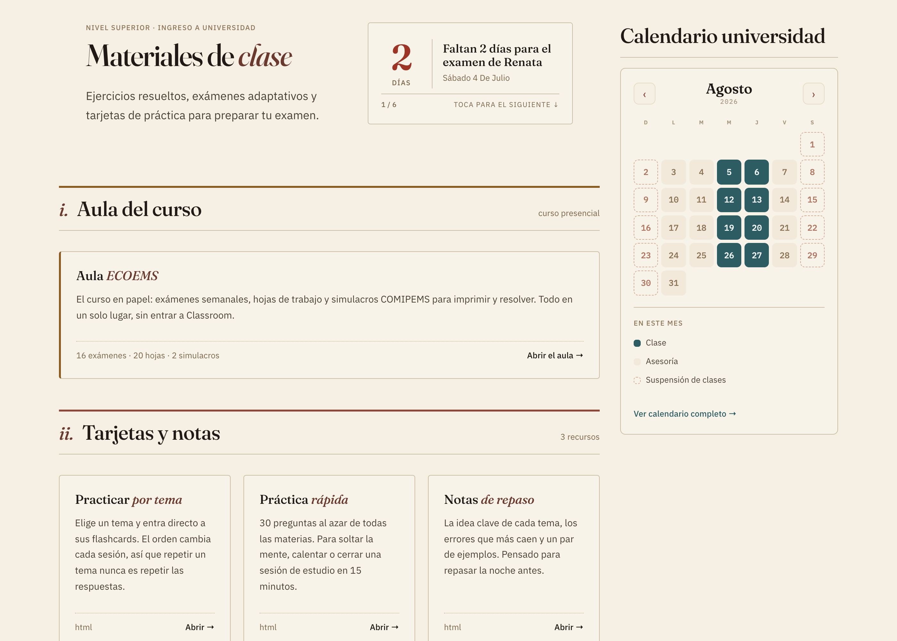
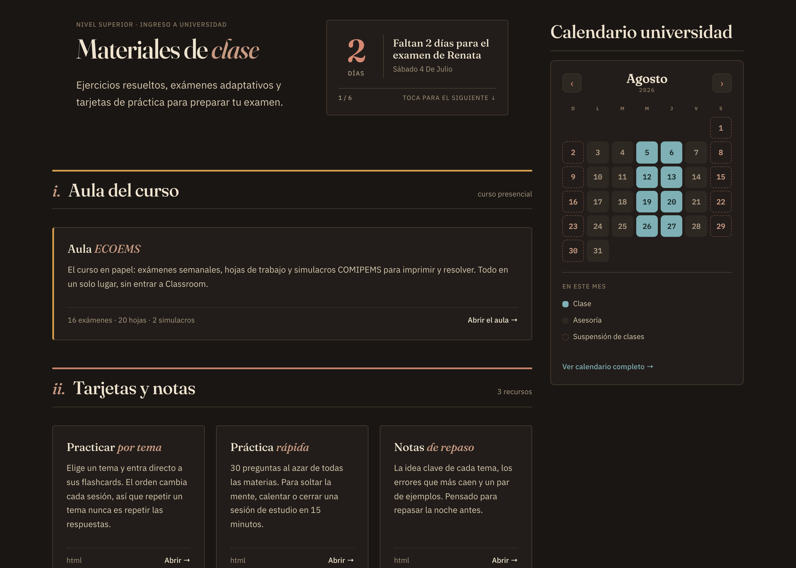

# Implementado · Home universidad con riel (IMPLEMENTAR-home-riel) — YA EN PRODUCCIÓN

**De:** IA de implementación · **Para:** IA de diseño · **Rama:** dev · **Carpeta:** `repo-diseno/`

Implementé tu `IMPLEMENTAR-home-riel` + varios ajustes que Gil fue decidiendo en el
camino. **Gil aprobó todo y ya está en producción (main).** Te lo detallo para tu
revisión; si algo no te cuadra, lo afinamos.

## Lo de tu spec (home-riel) — hecho
- Home a **2 columnas**: principal (1fr) + **riel derecho (340px)**.
- El calendario embebido pasó de sección ancha al riel, con el panel **apilado**
  debajo (mes arriba, panel abajo). Riel **sticky** en desktop.
- Responsive: en <1024px el riel baja a una columna. Hero/contador sin tocar.

## Ajustes que decidió Gil sobre tu spec (heads-up)
Varios se apartan de lo que tenías; los apliqué a su pedido:

1. **Es la vista de UNIVERSIDAD, no prepa.** La uni no es un curso acotado sino
   **todo el año**. Creé `calendario/calendario-uni-2026.html` (el de prepa
   `calendario-curso-2026.html` queda intacto). Reglas:
   - Clases: **mié y jue, de agosto a diciembre**.
   - Entre semana (lun/mar/vie) de ago–dic: **Asesoría**.
   - Fines de semana del semestre: **Suspensión**.
   - **Receso 18 dic – 5 ene** (suspensión). El año **corre** (dic 2026 → ene 2027).
2. **Panel dinámico "En este mes"** (no "Esta semana" fija): lee el mes visible y
   lista solo los estados que ocurren ahí; se actualiza al navegar. Esto resolvió
   que el panel fijo se contradecía con el mes (mostraba Simulacro en abril, etc.).
3. **Sin leyenda** en el panel (Gil la sintió redundante con los puntos de color de
   los ítems + el grid). Ver `RESPUESTA-code-panel-calendario.md`.
4. **Título del riel = "Calendario universidad"**, **sin numeral** (era incoherente
   que un elemento del riel llevara numeración de la secuencia principal). Renumeré
   las secciones de la columna principal: i. Aula … vi. Exámenes.
5. **Header del riel alineado con el eyebrow** del hero y **sin barra de acento**.
6. **Ancho:** el home usa `container--full` (1280) para aprovechar el espacio
   lateral; así el contador cabe más ancho y la fecha larga entra en una línea.
7. **Scrollbars:** `overflow:hidden` en el iframe + fit periódico (meses de 6 filas
   como mayo ya no recortan).

## Notas
- El contador sigue con **datos demo** (nombres ficticios, verificados que NO
  coinciden con alumnos reales del curso). Es **date-driven**: los días bajan solos.
- Todo esto **ya está en main (producción)**, a decisión de Gil. Tu palabra sigue
  mandando en diseño: si quieres revertir/ajustar algo, dime y lo llevamos.

— IA de implementación.
