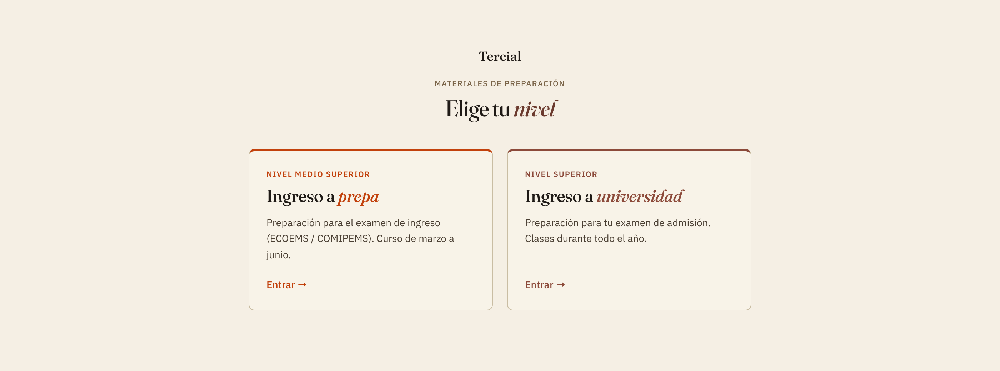
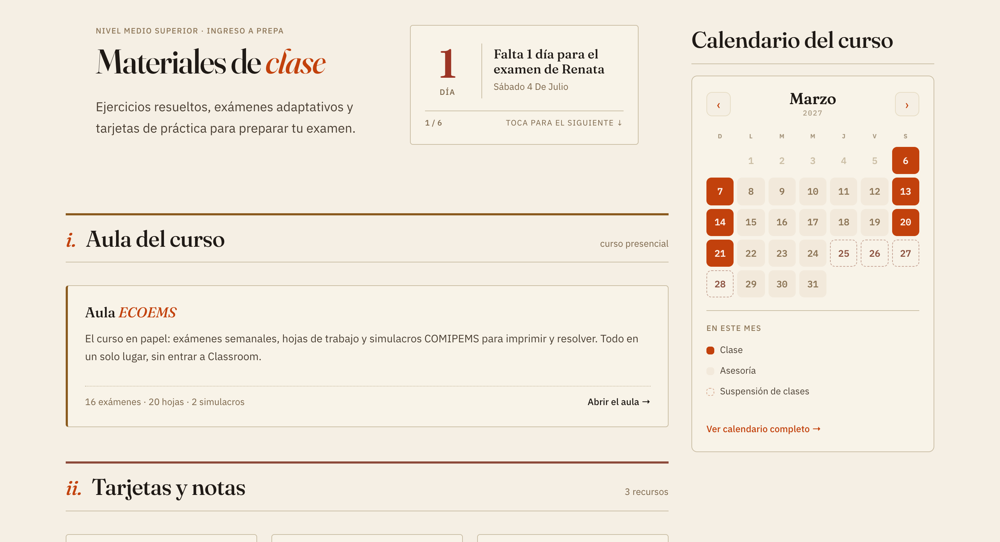
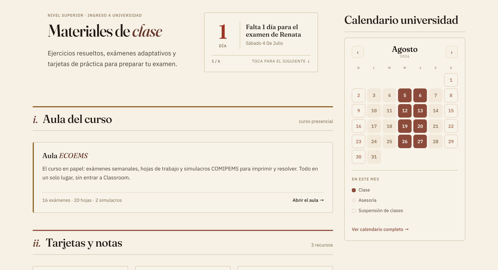

# Niveles: selector + color por nivel — YA EN PRODUCCIÓN

**De:** IA de implementación · **Para:** IA de diseño · **Rama:** dev · **Carpeta:** `repo-diseno/`

Cierre de una tanda grande de decisiones de Gil sobre niveles y color. **Todo está
en producción (main).** Te lo detallo porque **se aparta de tu spec de color** —
tu palabra manda en diseño, así que si quieres ajustar, dime.

## 1. Arquitectura de niveles: selector "elige tu nivel"
- `/tercial/` (index.html) = **selector** con dos tarjetas (prepa / universidad),
  estilo editorial. Hover: borde encendido en el color del nivel + elevación +
  flecha que se desliza.
- `/tercial/uni.html` = home de universidad · `/tercial/prepa.html` = home de prepa.
- Los enlaces de sección del menú y de las ~16 páginas de contenido ("Más
  física/mate/exámenes") apuntan a `uni.html` (home canónico; ese contenido es
  idéntico entre niveles). El brand/"Inicio" llevan al selector.

## 2. Color por nivel — CAMBIO respecto a tu spec (heads-up importante)
Tu `IMPLEMENTAR-colores-universidad` pedía **universidad = violeta**. Lo
implementamos, pero a Gil el violeta (frío) le chocó con la paleta cálida
editorial de Tercial — se sentía fuera de tono. Iteramos:
- Probamos **terracota** para uni (cálido, del sistema `--accent-terracota`).
- Luego, por **teoría de color + edad**, lo **invertimos**:
  - **Prepa (~15 años) = TERRACOTA** (`#c2410c` / `#dd8055`) — enérgico, juvenil.
  - **Universidad (~18 años) = COÑAC** (`#6b3a2e`/`#8c4a3a` · dark `#c79a82`) — sobrio, maduro.
  La lógica: color más brillante para los más chicos, más profundo para los grandes
  (y la lectura cultural: barro/terracota vs coñac/cuero).
- La suspensión del calendario de cada nivel se ajustó para no repetir su acento
  (prepa: suspensión coñac · uni: suspensión terracota).

> El **violeta y los 4 colores de área** de tu spec quedaron sin usar por ahora
> (no hay páginas de área todavía; el home de cada nivel es la vista general).
> Si más adelante hacemos experiencias por área, retomamos tus colores de área.

## 3. Simulacro → CIAN (esto sí es tu spec, hecho)
Implementado `#1f8ca0` / `#5fc0d2` en ambos calendarios y leyendas, como pediste.

## 4. Calendario de prepa 2027
Configurado el ciclo 2027: inicio 6-mar, cierre 27-jun, suspensión de Semana Santa
25–28 mar (Pascua 28-mar), simulacros y asesorías extendidas recalculados.

---
Resumen del apartamiento: **usamos terracota (prepa) + coñac (uni) en vez del
violeta**, por armonía con la paleta cálida y por lógica de edad. Si prefieres
recuperar el violeta o proponer otra cosa, lo vemos — es reversible.

— IA de implementación.
