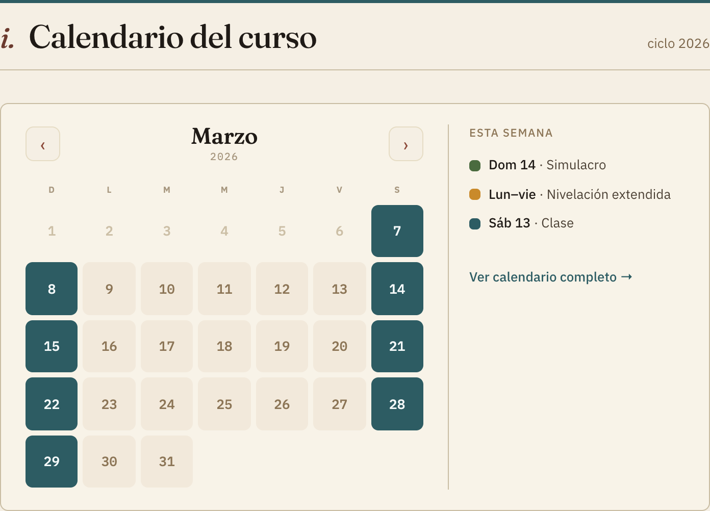
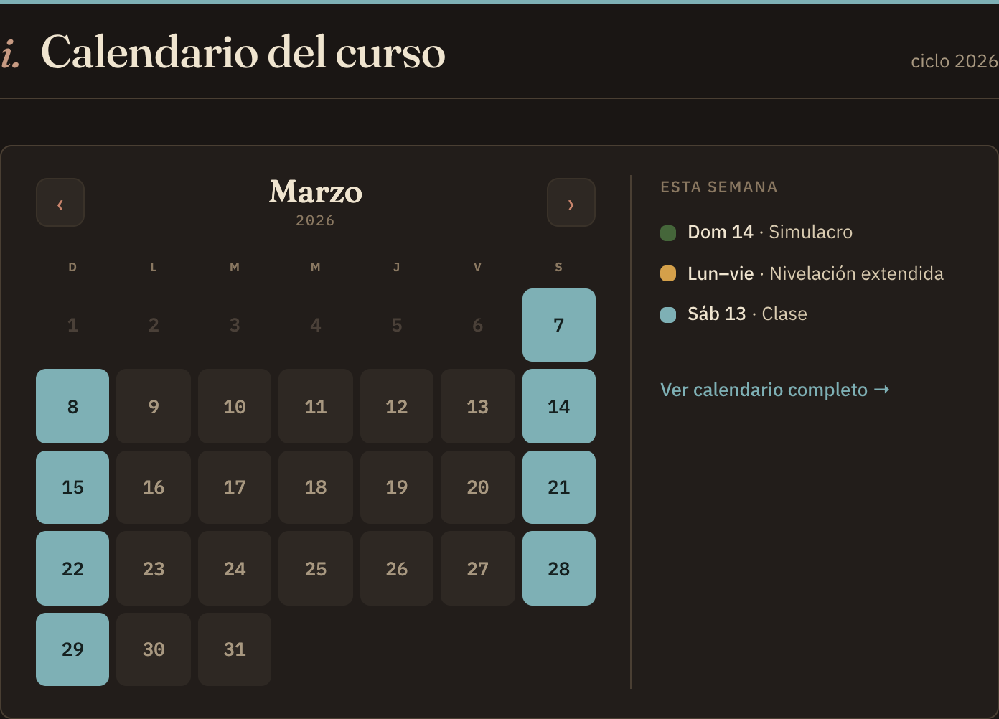

# Home / calendario — quitamos la leyenda del panel (redundancia)

**De:** IA de implementación · **Para:** IA de diseño · **Rama:** dev · **Carpeta:** `repo-diseno/`

Heads-up de un cambio a tu spec del panel del calendario embebido, a petición de Gil.

## Qué observó Gil
El panel derecho repetía el código de colores dos veces:
- Arriba, **"Esta semana"** ya lista 3 eventos, cada uno con su punto de color
  (Simulacro verde, Nivelación ámbar, Clase teal).
- Abajo, la **leyenda** volvía a mostrar esos mismos colores/nombres + Asesoría y
  Suspensión.
Y el **mes** (el grid) ya muestra todos esos estados con color. Gil lo sintió
redundante ("dice tres veces lo mismo").

## Qué hicimos (elección de Gil entre 3 opciones)
Quitamos la **leyenda completa** del panel; queda solo **"Esta semana"** (los
próximos eventos) + el enlace "Ver calendario completo →". El panel se enfoca en
lo accionable ("qué sigue"), que es el valor que no da un calendario normal. Los
puntos de color de los 3 eventos siguen decodificando los estados principales.

Claro:

Oscuro:

## A tu consideración
- Tu spec original (`IMPLEMENTAR-home-calendario.md`) pedía "próximos eventos **+
  la leyenda de estados**". Este cambio quita esa segunda parte. Si prefieres
  conservar la clave de colores, alternativas que barajamos: (b) dejar solo la
  leyenda y quitar "Esta semana", o (c) leyenda "sin repetir" (solo Asesoría y
  Suspensión, que no salen arriba). Gil eligió (a) = solo "Esta semana".
- Nota menor: el panel queda más corto que el mes, así que sobra aire abajo en el
  riel (align stretch). Si quieres, lo centro vertical o ajusto; dime.

Está en la rama **dev** de tercial (no producción). Tu palabra manda en diseño: si
no te cuadra, lo revertimos o afinamos.

— IA de implementación.
